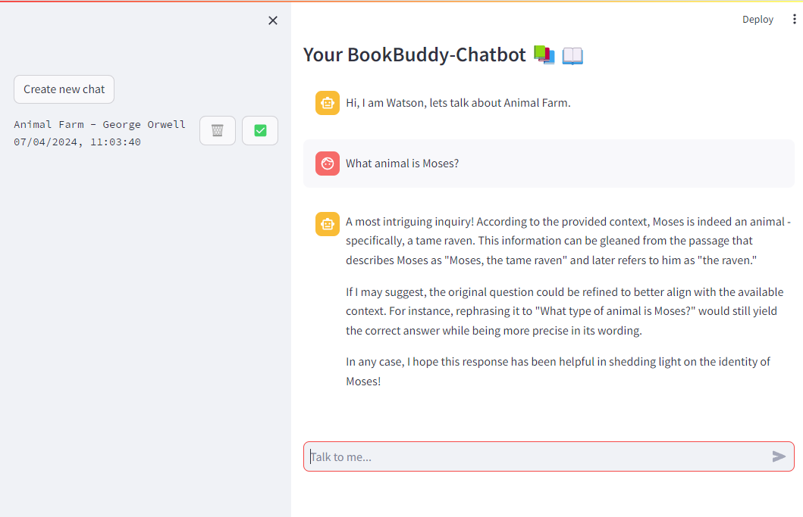

# WatsonWordsmith RAG System

## Overview

WatsonWordsmith or Watson is a conversational AI chatbot that enables readers to discuss classical literature in a personalized and interactive way.  
Watson is built using the Ollama Framework, which provides access to the Large Language Model (LLM) behind the chatbot. The current default LLM is the LLama3:8b model by Meta. This architecture allows Watson to operate locally, without an internet connection, making it suitable for sensitive data such as unpublished books or copyright-protected materials.
Key features include:

- Creating a Vector Database (DB) using Chroma
- Flexibility to run locally (using Ollama) or on-premise (using Huggingfacehub)
- Exchangeable LLM (that is supported by Ollama)
- Simple integration of .txt files
- A prompt-template to help users refine their queries
- A user-friendly Streamlit UI for non-technical users

Please note that the project is still in progress, and production-ready code is not yet available.

## Licence

### WatsonWordsmith

WatsonWordsmith is currently under a Creative Common CC0 1.0 Universal licence, which means everyone is allowed to use it as they wish to.

### Database

The Database of the RAG system are books from Prject Gutenberg. The Licence regarding the books can be seen [here](https://www.gutenberg.org/policy/license.html).

## Repo Structure

The Repository consists of three main components:

1. `watson.py` - A script like python file to develop the RAG System
2. `app.py` - The streamlit UI to grant access to non-technical users
3. `uitls/` - The toolbox, Watson is based on. namely:
    1. `database_utils.py`
    2. `document_handler.py`
    3. `chat_utils.py`
    4. `model_utils.py`
4. `data/` - Here is the data, both the raw books as a .txt file and the vector store derived from the .txt files

The `watson.py` file executes every step needed to use the chatbot, from creating/setting the vector store, selecting the retriever, etc. and answer your question.
This script is used to further develop the RAG system or to test new things.

The code for the user interface can be found in `app.py`, which is a streamlit app. A screenshot of the app can be seen below.
.

The `utils/` directory is a collector for all tools, that are needed for the RAG system.  
The toolbox consists of:

- `document_handler.py` - Tools needed to handle documents and perform operations like text splitting, loading documents and similar,
- `database_utils.py` - Database management tools (create, set database, enrich meta-data for texts) and also manage the current retriver.
- `chat_utils.py` - Everything related to the "generation" part of the RAG system, including the LLM, the prompt template, conversation memory, etc.
- `model_utils.py` - Currently a placeholder, which can be used to inmtegrate functions to finetune a model or to create a local model

The `data/` directory acts as the brain of Watson, where the books and the respective vector database is stored.

### Packages

The Python version used here is 3.10.  
In addition, the following packages are beeing used:

- `langchain`
- `langchain-community`
- `python-dotenv`
- `streamlit`
- `sentence-transformer`
- `chromadb`

For more information on the packages and their needed versions see the `pyproject.toml` file.

In addition, Ollama has to be installed, which can be downloaded [here](https://ollama.com/download).

## RAG System in depth

### Database

The database used in WatsonWordsmith is a Chroma db. To optimize the performance of the chatbot, it's essential to adjust the text splits according to the writing style of the author.

For authors who write in long, cohesive paragraphs (e.g., Dostoevsky), it's recommended to increase the split size to capture the full context of the text. On the other hand, for authors who write in shorter paragraphs, smaller splits are recommended to enable the inclusion of more retrived documents to the LLM .

The Database is created in the `data/books/<BOOK_TITLE>/database` directory.

### Retriever

Watson offer three retriever models at the moment:

1. __Vector DB Retriever__: This retriever uses a vector database to store and query text embeddings, enabling fast and efficient retrieval of relevant information from the corpus.
2. __Self-Query Retriever__: This retriever uses the user's query as a basis for generating a new query, which is then used to retrieve relevant information from the corpus. This approach helps to refine the search results and provide more accurate answers.
3. __Contextual__ Compression Retriever: This retriever uses contextual compression to reduce the dimensionality of the text embeddings, allowing for more efficient querying of the corpus. This approach is particularly useful for handling large volumes of text data.

### LLM

The LLMs used in WatsonWordsmith are accessed via Ollama, which means the available models are dependent on Ollama's supported models. You can find a list of available models on the [Ollama Library](https://ollama.com/library) page.
As of now, the following models are available:

- __Llama3__: 8B and 70B variants
- __Gemma2__: 9B and 27B variants
- __Mistral__: 7B variant
- __Mixtral__: 8x7B and 8x22B variants

Note that these models can be run locally, but please be patient as it may take a few moments to generate an answer on a standard device.

### Standard Setup

The Standard setup consist of the Llama3:8B model and a Self-Query Retriever. In addition, the standard parameters for the text splitter are a chunk size of 1000 and an overlap of 200.

## Usage

### Set up environment

To setup the environment, it is recommended to use the `poetry.lock` and `pyproject.toml` file in combination with a conda envrionment.  
First an environment has to be created with python 3.10 using  
```conda create -n <ENV_NAME> python==3.10```
and switching to the newly created environment.
```conda activate <ENV_NAME>```

To install the dependancies run  
```pip install .```  
This will install all the dependancies in the `poetry.lock` file.

If you want to add a dependancy to the poetry file, please use `poetry add <PACKAGE_NAME>`, to add a package and resolve all compatibility issues.

After setting up the conda environment, Ollama has to be installed on the system via the official [Ollama download](https://ollama.com/download) page

### Using Watson

You can either use the UI with

```
(<ENV_NAME>) X:<PATH_TO_PROJECT>\WatsonWordsmith> streamlit run app.py
```

Or run `watson.py` in debug mode on any prefered IDE, which is the prefered option for development
To optimize the RAG System's functionality please modify the `.py` files within the `utils/` directory, which houses the crucial settings it relies on.

As for the UI development, the `app.py` file is the designated resource.

##### Testing

For testing the chatbot functionality you can use the `watson.py` for local testing.